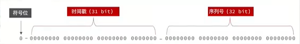
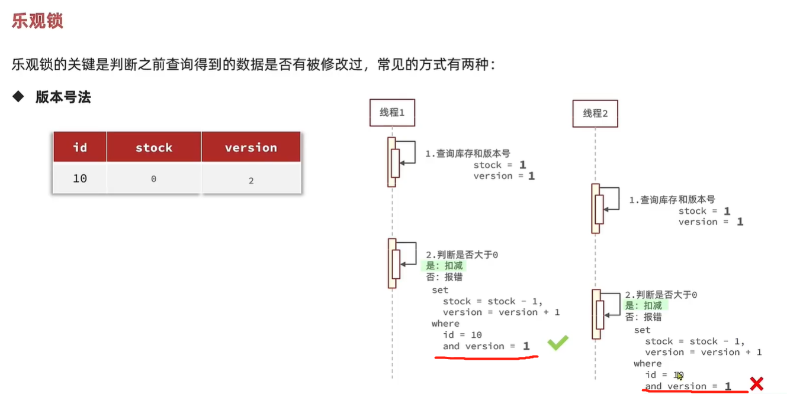
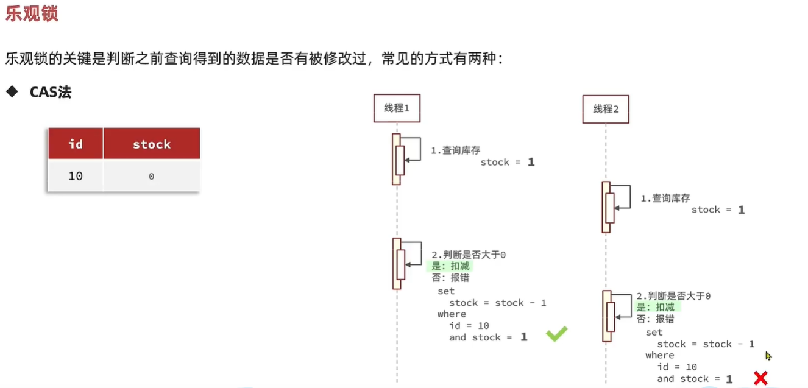
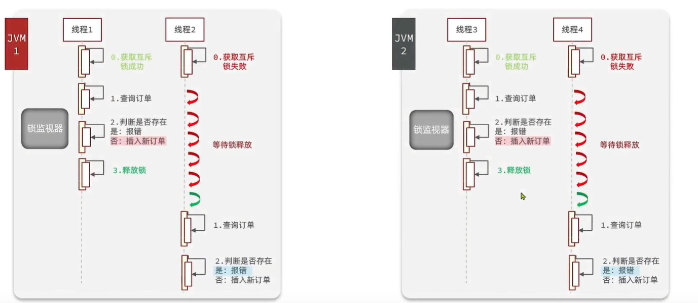
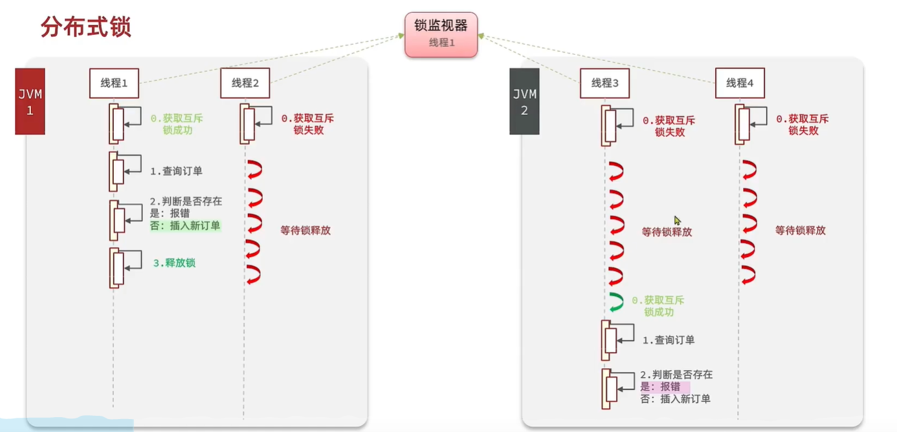
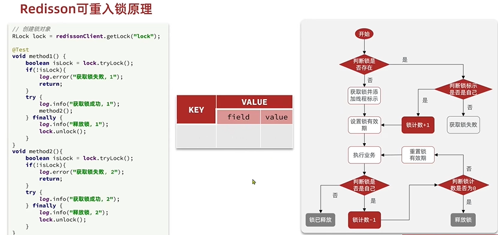
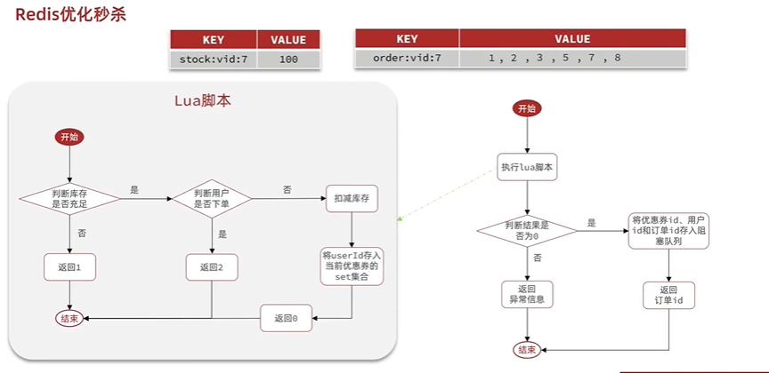

redis使用

1.缓存使用（重点文件：ShopController.java）

缓存穿透：缓存空值且设置有效期，如果查询缓存为空值而不是Null，则直接返回，不去查询数据库
缓存击穿：
(1).互斥锁：利用setIfAbsent(key,"",30L,MINUTES)方法，返回true则拿到锁，反之则休眠一段时间重新查询缓存数据，如果缓存数据依然没有，则继续获取互斥锁。拿到锁后重建缓存结束，需要释放锁（delete(key)）
(2).逻辑过期：设置一个ttl为1的缓存数据，如果未查询到则表明这数据就不需要被访问。配合使用互斥锁，如果使用逻辑判断已过期，则需要获取锁进行缓存重建，如果不过期，或者没有拿到锁则直接返回缓存数据。

2.全局唯一ID(重点文件：RedisIdWorker.java)

redis自增ID策略：
 每天一个key，方便统计订单量,限定自增值
 ID构造是 时间戳+计数器

3.优惠券秒杀(重点文件:VoucherOrderController.java，seckillVoucher方法)

（1）乐观锁：

（2）悲观锁：在分布式系统下不生效（synchronized）

（3）分布式锁：（重点文件：SimpleRedisLock.java，seckillVoucher方法）

问题一：会删除不是自己的锁，自己的锁由于发生业务阻塞被超时释放，等阻塞结束，此时的锁是其他线程添加的锁。
解决方案：锁增加线程标识，判断是否是自己的锁

问题二：在删除锁之前，判断锁一致之后发生阻塞，导致超时释放锁，此时的锁已经是其他线程添加的锁。
解决方案：判断锁和删除锁保证原子性（Lua脚本）

redis的分布式锁可使用redisson客户端，具有可重入锁，可重试功能
（4）Redisson的可重入锁原理(Lua脚本实现)
通过hash结构，记录线程标识和重入次数，利用信号量控制锁重试等待

问题三：redisson分布式锁主从一致性问题 ：主节点处理写操作，从节点处理读操作，主节点数据同步从节点存在延时问题，如果在主从同步期间主节点宕机，从节点变成主节点，未同步成功的数据会丢失。
解决方案：使用redisson联锁multiLock，多个独立的redis节点，必须在所有节点都获取重入锁才算成功

优化方案1：异步下单实现下单功能
库存信息使用String结构
下单信息使用Set结构
（1）、基于Lua脚本，判断秒杀库存、一人一单，决定用户是否抢购成功
（2）、如果抢购成功，将优惠券ID和用户ID封装后存入阻塞队列
（3）、开启线程任务，不断从阻塞队列中获取信息，实现异步下单功能

