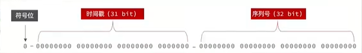
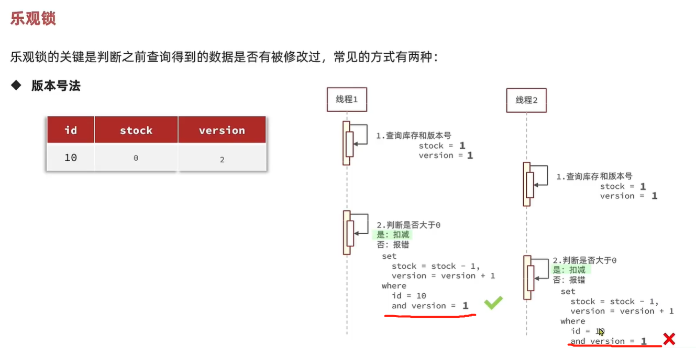
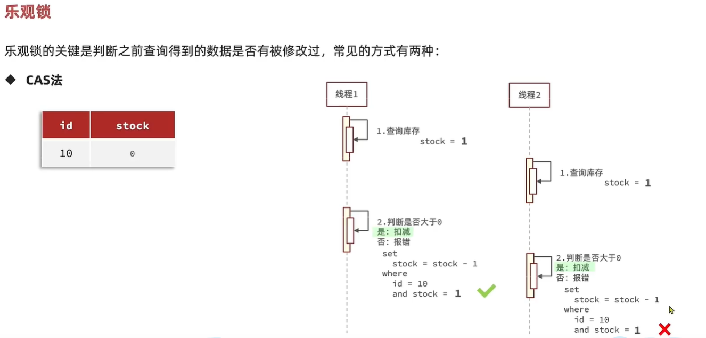
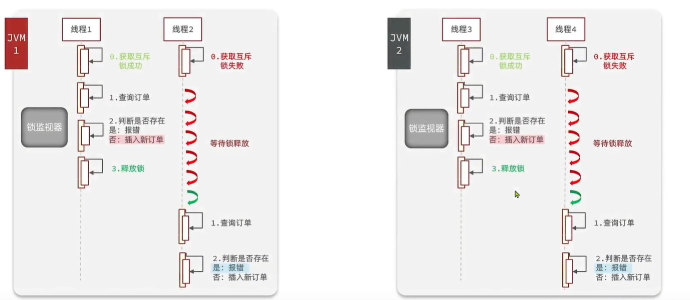
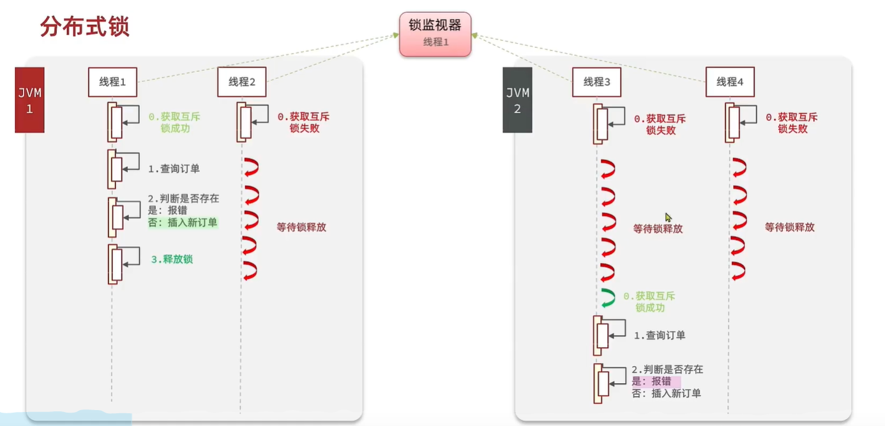

redis使用

1.缓存使用（重点文件：ShopController.java）
缓存穿透：缓存空值且设置有效期，如果查询缓存为空值而不是Null，则直接返回，不去查询数据库
缓存击穿：
(1).互斥锁：利用setIfAbsent(key,"",30L,MINUTES)方法，返回true则拿到锁，反之则休眠一段时间重新查询缓存数据，如果缓存数据依然没有，则继续获取互斥锁。拿到锁后重建缓存结束，需要释放锁（delete(key)）
(2).逻辑过期：设置一个ttl为1的缓存数据，如果未查询到则表明这数据就不需要被访问。配合使用互斥锁，如果使用逻辑判断已过期，则需要获取锁进行缓存重建，如果不过期，或者没有拿到锁则直接返回缓存数据。

2.全局唯一ID(重点文件：RedisIdWorker.java)

redis自增ID策略：
 每天一个key，方便统计订单量,限定自增值
 ID构造是 时间戳+计数器

3.优惠券秒杀(重点文件:VoucherOrderController.java)
乐观锁：

悲观锁：在分布式系统下不生效（synchronized）

分布式锁：

